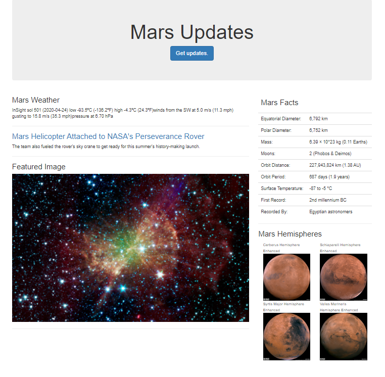

# Web Scraping Challenge

Demo web application utilizes python to scrape multiple sites for data on the Mission to Mars, then import the data into MongoDB and display it on a single bootstrap web page with Flask. Employs beautifulsoup, splinter, requests, & pandas.

View the application code [here](/app.py), and the scrape code [here](/scrape_m_hemis.py) & [here](/scrape_mars).

Screenshot:

This project was completed for Rutgers Data Science Bootcamp.  
